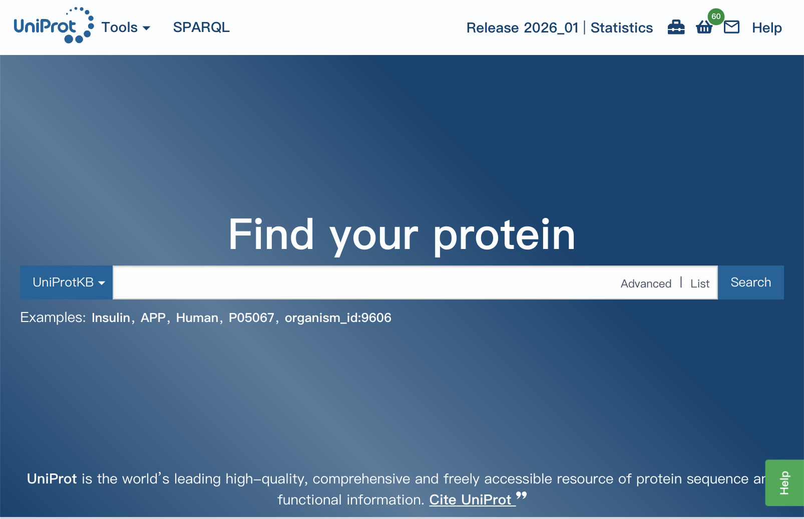
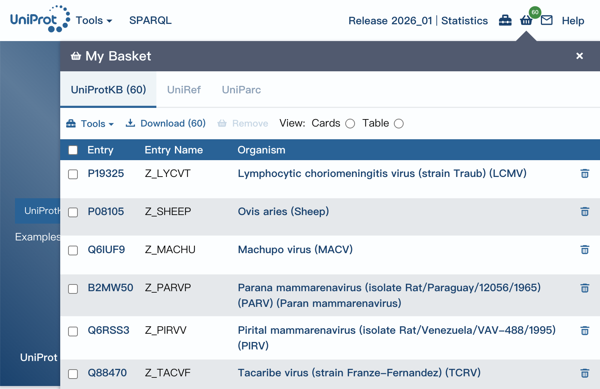
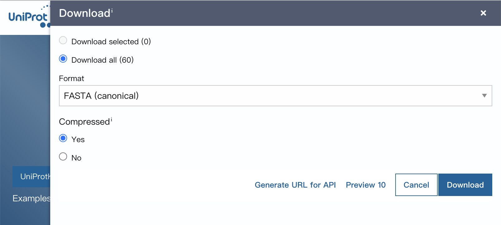

# Data 說明

## 來源：[UniProt.org](https://www.uniprot.org/)
格式：
```
>sp|P0AC51|ZUR_ECOLI Zinc uptake regulation protein OS=Escherichia coli (strain K12) OX=83333 GN=zur PE=1 SV=1
MEKTTTQELLAQAEKICAQRNVRLTPQRLEVLRLMSLQDGAISAYDLLDLLREAEPQAKP
PTVYRALDFLLEQGFVHKVESTNSYVLCHLFDQPTHTSAMFICDRCGAVKEECAEGVEDI
MHTLAAKMGFALRHNVIEAHGLCAACVEVEACRHPEQCQHDHSVQVKKKPR
```

## 資料處理流程
### 1. 到 UniPort 下載 data




### 2. Extract the examples into individual files
```shell
python3 FastaTool.py <Downloaded File Name>.fa --disassemble
```
會自動抓取 ID 作為檔名，並修改格式如下：
```
>P15421
MYGKIIFVLLLSGIVSISASSTTGVAMHTSTSSSVTKSYISSQTNGITLINWWAMARVIFEVMLVVVGMIILISYCIR
```

### 3. Multiple Sequence
設定 csv file:
|UniProt ID|Protein length|
|:----:|:----:|
|P19325|72|
|P08105|79|

```shell
python3 FastaTool.py <CSV File Name>.csv --assemble --name=<Output File Name>
```
可以合併 fasta files

## FastaTool.py
### 1. Disassemble
此功能用於將從 UniProt 下載的大型 FASTA 檔案拆解為個別的序列檔案。
- **輸入**：包含多條序列的 FASTA 檔。
- **邏輯**：
  - 透過正則表達式 `>sp|ID|` 或 `>tr|ID|` 抓取 UniProt ID。
  - 將該 ID 的序列內容串接成單一行（移除換行符號）。
  - 寫入新檔案 `{ID}.fasta`。
- **使用方式**：
  ```bash
  python3 FastaTool.py input.fasta --disassemble
  ```

### 2. Assemble
此功能用於根據 CSV 檔案中的列表，將分散的 FASTA 檔案合併。
- **輸入**：包含 `UniProt ID` 欄位的 CSV 檔。
- **邏輯**：
  - 讀取 CSV 每一列的 ID。
  - 尋找當前目錄下是否存在 `{ID}.fasta`。
  - 若存在，將其內容讀取並寫入至指定的輸出檔案中。
- **使用方式**：
  ```bash
  python3 FastaTool.py list.csv --assemble --name output.fasta
  ```
